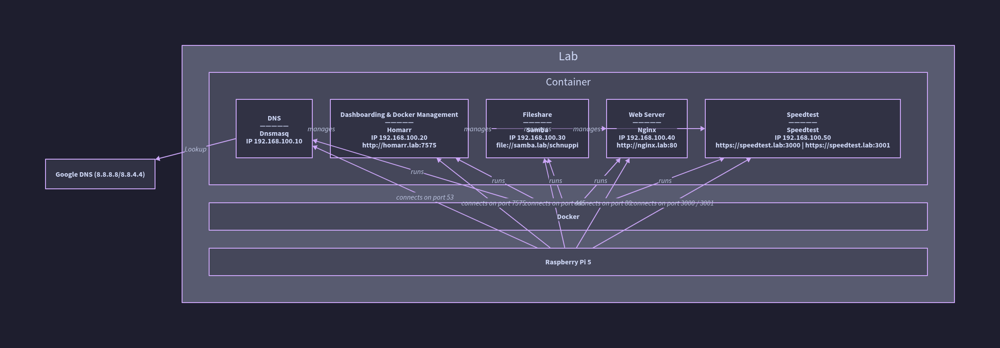

# Raspberry Pi 5 Test Setup
- [Raspberry Pi 5 Test Setup](#raspberry-pi-5-test-setup)
  - [Introduction](#introduction)
    - [Raspberry Pi 5 Model B (8 GB RAM)](#raspberry-pi-5-model-b-8-gb-ram)
  - [Services](#services)
    - [Homarr](#homarr)
    - [dnsmasq](#dnsmasq)
    - [Speedtest](#speedtest)
    - [Samba](#samba)
    - [Nginx Web Server](#nginx-web-server)
  - [System Architecture](#system-architecture)
  - [Installation](#installation)
    - [Raspberry Pi Setup](#raspberry-pi-setup)
      - [Installing Raspberry Pi OS](#installing-raspberry-pi-os)
      - [Installing Docker](#installing-docker)
      - [Create virtual Docker network for our envrionment](#create-virtual-docker-network-for-our-envrionment)
    - [Docker Service Containers](#docker-service-containers)
      - [Installing dnsmasq in a Docker Container](#installing-dnsmasq-in-a-docker-container)
      - [Installing Homarr in a Docker Container](#installing-homarr-in-a-docker-container)
      - [Installing Samba Fileshare in a Docker Container](#installing-samba-fileshare-in-a-docker-container)
      - [Installing NGINX Webserver in a Docker Container](#installing-nginx-webserver-in-a-docker-container)
      - [Installing a Speedtest Site in a Docker Container](#installing-a-speedtest-site-in-a-docker-container)
  - [Conclusion](#conclusion)
  - [References](#references)
    - [Raspberry Pi](#raspberry-pi)
    - [Docker](#docker)
    - [DNSmasq](#dnsmasq-1)
    - [Homarr](#homarr-1)
    - [Samba](#samba-1)
    - [Nginx](#nginx)
    - [Speedtest](#speedtest-1)


## Introduction
This document provides instructions for setting up a Raspberry Pi 5b with 8 GB RAM, installing Raspberry Pi OS, and configuring services with docker.

### Raspberry Pi 5 Model B (8 GB RAM)
The Raspberry Pi 5 Model B is the latest iteration in the Raspberry Pi series, delivering a significant performance boost over its predecessor. Equipped with an 8 GB LPDDR4X RAM, it offers improved multitasking capabilities, making it ideal for power users and advanced projects.

Powered by a Broadcom quad-core 64-bit Arm Cortex-A76 CPU, running at 2.4 GHz, the Pi 5 provides 2–3x faster CPU performance compared to the Raspberry Pi 4. It also features a VideoCore VII GPU, enhancing graphics performance for media playback and gaming applications.

Key enhancements include:
- Dual 4K HDMI outputs (supporting 4K at 60Hz with HDR)
- PCIe 2.0 interface (for NVMe SSD expansion with an adapter)
- USB 3.0 and USB-C Power Delivery for faster data transfers and better power efficiency
- Gigabit Ethernet and Wi-Fi 5 for high-speed networking
- Dedicated power button for improved usability

## Services

The setup includes multiple services running in Docker containers, each assigned a dedicated IP address. These services provide essential functionality such as DNS resolution, dashboard management, network speed testing, file sharing, and web hosting.

### Homarr
[Homarr](https://github.com/ajnart/homarr) is a self-hosted dashboard designed to centralize access to web applications and services in a single, user-friendly interface.

**Features:**
- Customizable widgets and themes
- Integration with various self-hosted services
- Drag-and-drop organization of application shortcuts
- Live monitoring for connected services

**Pros:**
- Simple and visually appealing interface
- Easy to set up and configure
- Open-source and actively maintained

**Cons:**
- Limited advanced automation features
- Requires manual configuration for integrations

### dnsmasq
[dnsmasq](http://www.thekelleys.org.uk/dnsmasq/doc.html) is a lightweight DNS forwarder and DHCP server designed to simplify local network management.

**Features:**
- DNS caching and forwarding
- DHCP server capabilities
- Support for custom domain resolution

**Pros:**
- Low resource usage
- Easy to configure
- Improves network performance with caching

**Cons:**
- Limited scalability compared to enterprise-grade DNS solutions
- No built-in GUI for management

### Speedtest
[Speedtest](https://github.com/openspeedtest/Speed-Test) is a self-hosted network speed testing tool that provides insights into internet performance.

**Features:**
- Measures download and upload speeds
- Provides latency and jitter metrics
- Works without third-party services like Ookla

**Pros:**
- Self-hosted and privacy-friendly
- No external dependencies
- Lightweight and simple to deploy

**Cons:**
- Lacks advanced analytics features
- Results may vary based on local network conditions

### Samba
[Samba](https://www.samba.org/) is an open-source implementation of the SMB/CIFS protocol, enabling file and printer sharing across different operating systems.

**Features:**
- File sharing between Linux, Windows, and macOS
- User authentication and access control
- Printer sharing support

**Pros:**
- Cross-platform compatibility
- Configurable user permissions
- Actively maintained and widely used

**Cons:**
- Requires manual configuration for advanced setups
- Security risks if not properly managed

### Nginx Web Server
[Nginx](https://nginx.org/) is a high-performance web server and reverse proxy, often used for serving websites and applications.

**Features:**
- Reverse proxying and load balancing
- Static and dynamic content serving
- Secure HTTPS support with SSL/TLS

**Pros:**
- High performance and low resource consumption
- Scalable for small to large deployments
- Strong security and reliability

**Cons:**
- Requires manual configuration for complex setups
- Steeper learning curve compared to some alternatives

---

## System Architecture
Below is a diagram of the system architecture using `d2`: [architecture.d2](./docs/architecture.d2)



---

## Installation

### Raspberry Pi Setup

#### Installing Raspberry Pi OS
1. Install "Raspberry Pi Imager" from [Raspberry Pi - Software](https://www.raspberrypi.com/software/)
   ```bash
   sudo apt install rpi-imager -y
   ```

2. Start the imager software [Raspberry Pi Imager](https://www.raspberrypi.com/software/)
   ```bash
   rpi-imager
   ```

3. Flash the OS to a microSD card using [Raspberry Pi Imager](https://www.raspberrypi.com/software/).

  2.1. Configure Raspberry Pi OS in Imager...
  Follow steps on [Getting Started -> Raspberry Pi Imager](https://www.raspberrypi.com/documentation/computers/getting-started.html#raspberry-pi-imager)


3. Insert the microSD card into the Raspberry Pi and power it on.

#### Installing Docker
1. Update the system:
   ```sh
   sudo apt update && sudo apt upgrade -y
   ```

2. Install Docker:
   ```sh
   curl -sSL https://get.docker.com | sh
   ```

3. Add the current user to the Docker group:
   ```sh
   sudo usermod -aG docker $USER
   ```

4. Reboot
   ```sh
   reboot
   ```

5. Verify the installation:
   ```sh
   docker --version
   ```

6. Run "Hello-World" to test:
   ```bash
   docker run hello-world
   ```

   Output should start with the following message:
   ```bash
   Hello from Docker!
   This message shows that your installation appears to be working correctly.
   ```

#### Create virtual Docker network for our envrionment
To work with classic DNS we have to make sure our containers have a fixed IP. To archive this, we create a local Docker network *192.168.100.0/24*.

Important: In production environments it is not great to have fixed IP addresses in Docker! Docker itself brings it's own DNS logic and for scalability it is not good if a container relies on a dedicated IP address. But for our lab we want to manage our own DNS for learning purposes.

1. Create a Docker network
   ```bash
   docker network create --subnet=192.168.100.0/24 private_lab
   ```

### Docker Service Containers

#### Installing dnsmasq in a Docker Container
[dnsmasq install.md](./installation_files/dnsmasq/install.md)

#### Installing Homarr in a Docker Container
[Homarr install.md](./installation_files/homarr/install.md)

#### Installing Samba Fileshare in a Docker Container
[Samba install.md](./installation_files/samba/install.md)

#### Installing NGINX Webserver in a Docker Container
[Nginx install.md](./installation_files/nginx/install.md)

#### Installing a Speedtest Site in a Docker Container
[Speedtest install.md](./installation_files/speedtest/install.md)

---

## Conclusion
You have successfully set up a Raspberry Pi 5 with Docker and many services. Homarr should now be accessible at `http://homarr.lab:7575` for managing the other docker containers. If you encounter any issues, check the logs:

```sh
sudo journalctl -u dnsmasq --no-pager
```

```sh
docker logs homarr
```

---

## References
### Raspberry Pi
- [Raspberry Pi Official Website](https://www.raspberrypi.org/)

### Docker
- [Docker Documentation](https://docs.docker.com/)
- [Installing Docker on the Raspberry Pi](https://pimylifeup.com/raspberry-pi-docker/)
- [Docker Networking](https://docs.docker.com/engine/network/)

### DNSmasq
- [dnsmasq Documentation](http://www.thekelleys.org.uk/dnsmasq/doc.html)
- [Github - jasjeev4 DNSMasq](https://github.com/jasjeev4/rpi-docker-dnsmasq/tree/master?tab=readme-ov-file)

### Homarr
- [Homarr Repository](https://github.com/ajnart/homarr)
- [PiMyLifeUp - Installing the Homarr Dashboard on the Raspberry Pi](https://pimylifeup.com/raspberry-pi-homarr-dashboard/)

### Samba
- [PiMyLifeUp - Setting up a Samba Share using Docker](https://pimylifeup.com/docker-samba-share/)

### Nginx
- [Stackoverflow - How do I create a working Docker Image from html, css, js files?](https://stackoverflow.com/questions/76588504/how-do-i-create-a-working-docker-image-from-html-css-js-files)

### Speedtest
- [Setting up a Speedtest Tracker using Docker](https://pimylifeup.com/docker-internet-speedtest-tracker/)
- [Installing Speedtest Using Docker Compose](https://docs.speedtest-tracker.dev/getting-started/installation/using-docker-compose)
